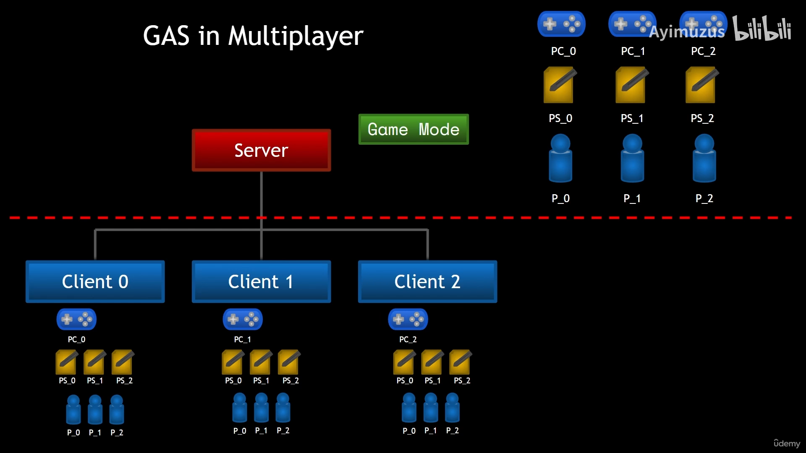
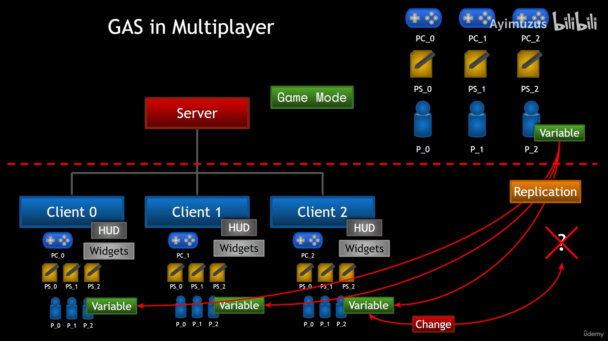
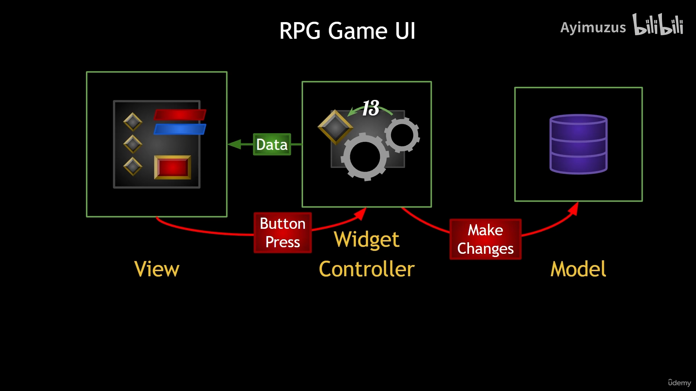

# Aura

Developed with Unreal Engine 5

## Part I: Introduction

## Part II: Project Setup and Character Creation

- Create a new project with the `Third Person` template

I will be using the `Third Person` template for this 
project. This template comes with a character that has a 
skeletal mesh and animations. The character is controlled 
by the player using the keyboard and mouse.

- Set Up the Editor and Project settings

- Import the Game Assets

- Create the Character Classes and Animations

- Set Up the Player Controller and Game Mode

- Case: Highlight the Enemy Character when we put the 
  cursor over it

## Part III: The GAS System

### The PlayerState

PlayerState is a class to record the state of a player, like health,
mana or other attributes. According to the figure above, the PlayerState
is mounted on the PlayerController to avoid character states being lost 
when the character is destroyed. Steps to create a PlayerState class is
followed:

* Create a new C++ class called `AuraPlayerState` that inherits from `APlayerState`
* Set the `NetUpdateFrequency` to higher value like 100.0f, the 
original value is too slow.
* Add the `AuraPlayerState` to your `GameMode` class

### Multiplayer Game Ability System

#### When should we Init Ability Actor Info?
**Answer**: Must be done after possession (the Controller has been set
for the Pawn)

* Player-Controlled Character
  * ASC Lives on the Pawn (Both Owner and Avatar is the Pawn)
    * Server
    
      Called in `PossessedBy` server-only function.
    * Client
    
      Called in `AcknowledgePossession` client-only function.
  * ASC Lives on the PlayerState (Owner is the PlayerState, Avatar is the Pawn)
    * Server
    
      Called in `PossessedBy` server-only function.
    * Client
    
      Called in `OnRep_PlayerState` client-only function.
* AI-Controlled Character
  * ASC Lives on the Pawn (Both Owner and Avatar is the Pawn)
    * Server
    
      Called in `BeginPlay` server-only function.
    * Client
    
      Called in `BeginPlay` client-only function.

`PossessedBy` is a server-only function that is called 
when the Pawn is possessed by a Controller.

`AcknowledgePossession` is a client-only function that is
called when the possession has been established.

`OnRep_PlayerState` is a client-only OnRep-notify function that is 
called when the PlayerState is available on the client.

<mark>!! Note</mark>: The `InitAbilityActorInfo` function should be called with **OwnerActor**'s
**Owner** to be a **Controller**. If it's not, then manually call `SetOwner` function
to set the **Owner** of **OwnerActor** to be a **Controller**.

### UI (Widget, Widget Controller and Model)

#### Overview of the UI structure

How can we inform our players with their pawn's attributes? How to make them know their current health,
mana and note them when there's an interactable object in front of them. UI is important in game, which
can directly deliver your thoughts to your players.

UI is usually composed of many widgets, which are used to show information. Then, under the interface, 
we have the widget controller to control the widget, and the model possess attributes to be shown.
From a software engineering perspective, these three parts should only have a one-way dependency, which
means the model should have no idea about the widget controller, and widget controller should not know
which widget it is related to. The relationship between these three parts is shown below:

According to this picture, the widget is responsible for showing the data, and the  

#### Widget Controller

If you try to search for the widget controller in all UE base c++ classes, you will find nothing.
Widget Controller is not an integrated base class in UE, so we should create it from scratch.

The base class of all widget controlle